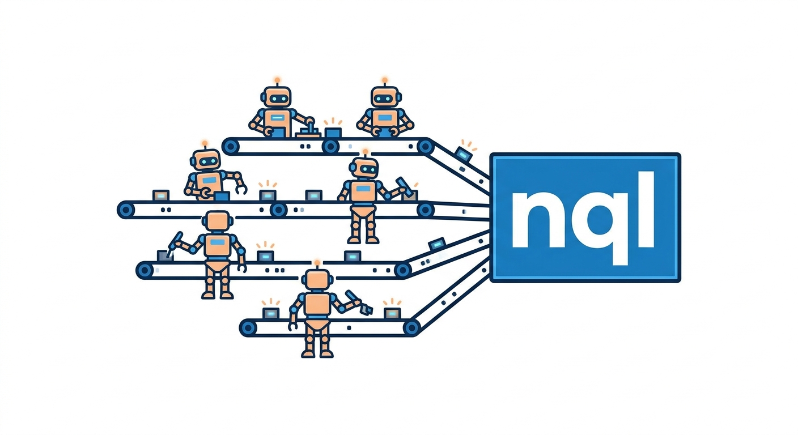

# nql



**NQL** — SQL compiler with AI function calls, targeting multiple databases. A dbt-style runner for models that can call LLMs from inside SQL.

## Install

### Cargo

```
cargo install nql
```

### Pre-built binaries

Download the latest release from [GitHub releases](https://github.com/npc-worldwide/nql/releases).

### Homebrew (planned)

```
brew install npc-worldwide/tap/nql
```

## Use

```
nql compile my_model --models-dir ./models --target sqlite
nql run my_model --models-dir ./models --db ./data.db --target sqlite
nql run --models-dir ./models --db ./data.db  # runs all models in dependency order
```

### Targets

- `sqlite`
- `postgresql`
- `snowflake`
- `bigquery`

### Model file

```sql
-- models/fct_users.sql
{{ config(materialized='table') }}

SELECT
    user_id,
    nql.summarize(bio) as bio_summary,
    nql.extract_entities(bio) as entities
FROM {{ ref('stg_users') }}
```

`nql.*` functions call an LLM at compile time or emit native AI SQL (e.g. Snowflake Cortex, BigQuery AI.GENERATE) depending on target.

## License

MIT
